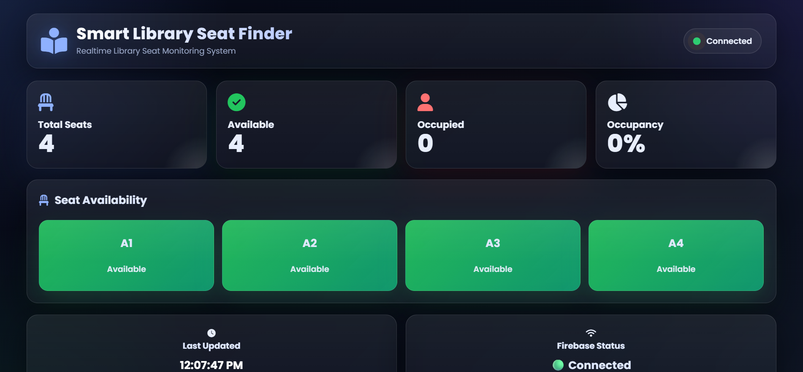
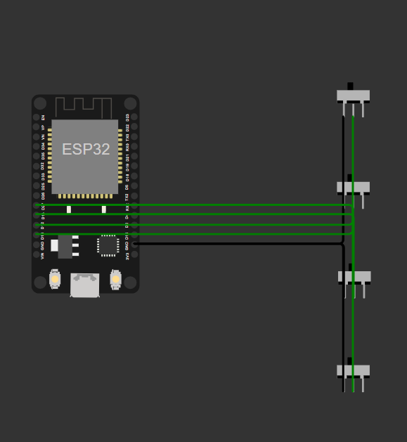
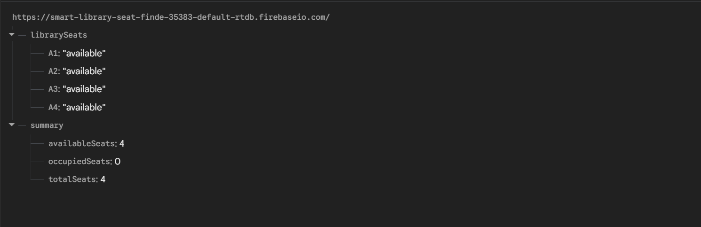

# 📚 Smart Library Seat Finder using ESP32, Firebase & Web Dashboard




</p>

---

# 📖 Overview

**Smart Library Seat Finder** is a real-time IoT project that helps students locate available seats inside a library.

The system uses an **ESP32** (simulated in Wokwi) to monitor seat occupancy. The seat status is uploaded to **Firebase Realtime Database**, and a professional **HTML, CSS, and JavaScript dashboard** displays the current availability in real time.

This project demonstrates the integration of embedded systems, cloud databases, and web technologies for smart campus applications.

---

# 🚀 Features

### 🔹 IoT Features

- ESP32 based seat monitoring
- Wokwi online simulation
- WiFi communication
- Firebase Realtime Database
- Real-time data synchronization

---

### 🔹 Dashboard Features

- Live seat availability
- Real-time seat status
- Total seat counter
- Available seat counter
- Occupied seat counter
- Occupancy percentage
- Firebase connection status
- Last updated timestamp
- Responsive dashboard
- Modern UI

---

### 🔹 Future Enhancements

- RFID authentication
- QR code seat reservation
- Multi-floor library support
- Search seat
- Floor filter
- Dark mode
- Mobile application
- Admin dashboard
- Analytics
- Occupancy heatmap
- Email notifications

---

# 🏗 System Architecture

```
             ESP32
                │
                │
         Seat Sensors
                │
                ▼
        WiFi Communication
                │
                ▼
Firebase Realtime Database
                │
                ▼
      Web Dashboard
                │
                ▼
         Students / Librarian
```

---

# 🛠 Technologies Used

| Technology | Purpose |
|------------|----------|
| ESP32 | IoT Controller |
| Wokwi | Hardware Simulation |
| Firebase | Cloud Database |
| HTML5 | Dashboard |
| CSS3 | User Interface |
| JavaScript | Dashboard Logic |
| VS Code | Development |
| GitHub | Version Control |

---

# 📂 Project Structure

```
SMART_LIBRARY_SEAT_FINDER/

│
├── dashboard/
│   ├── index.html
│   ├── css/
│   │     └── style.css
│   ├── js/
│   │     ├── firebase-config.js
│   │     └── dashboard.js
│   └── images/
│
├── screenshots/
│   ├── dashboard.png
│   ├── circuit.png
│   └── database.png
│
├── wokwi/
│   ├── sketch.ino
│   ├── diagram.json
│   └── libraries.txt
│
├── README.md
```

---

# 📸 Project Screenshots

## Dashboard


---

## Wokwi Circuit



---

## Firebase Database



---

# 🔥 Firebase Database Structure

```json
{
  "librarySeats": {
    "A1": "available",
    "A2": "occupied",
    "A3": "available",
    "A4": "occupied"
  },

  "summary": {
    "totalSeats": 4,
    "availableSeats": 2,
    "occupiedSeats": 2
  }
}
```

---

# ⚙ Hardware Components

- ESP32 DevKit V1
- Slide Switches (Seat Sensors)
- WiFi
- Firebase Realtime Database
- Wokwi Simulator

---

# 💻 Software Requirements

- Arduino IDE
- VS Code
- Live Server Extension
- Firebase Console
- GitHub

---

# ⚙ Installation

## 1. Clone Repository

```bash
git clone https://github.com/YOUR_USERNAME/SMART_LIBRARY_SEAT_FINDER.git
```

---

## 2. Open Project

Open the project using **VS Code**.

---

## 3. Configure Firebase

Open

```
dashboard/js/firebase-config.js
```

Replace with your Firebase configuration.

```javascript
const firebaseConfig = {

  apiKey: "YOUR_API_KEY",

  authDomain: "YOUR_PROJECT.firebaseapp.com",

  databaseURL: "YOUR_DATABASE_URL",

  projectId: "YOUR_PROJECT",

  storageBucket: "YOUR_BUCKET",

  messagingSenderId: "YOUR_ID",

  appId: "YOUR_APP_ID"

};
```

---

## 4. Run Dashboard

Install **Live Server** extension.

Right-click

```
dashboard/index.html
```

Click

```
Open with Live Server
```

---

## 5. Run ESP32 Simulation

Open

```
wokwi/
```

Load

- sketch.ino
- diagram.json

Run the simulation.

Changing any switch updates Firebase automatically.

---

# 📊 Dashboard Information

The dashboard displays

- Live Seat Status
- Total Seats
- Available Seats
- Occupied Seats
- Occupancy Percentage
- Firebase Connection Status
- Last Updated Time

---

# 📈 Future Roadmap

- Multi-floor Library
- QR Seat Reservation
- RFID Authentication
- Analytics Dashboard
- Admin Login
- Activity Logs
- Email Alerts
- Mobile Application
- AI Seat Recommendation
- Heatmap Visualization

---

# 🌍 Deployment

The dashboard can be deployed using

- GitHub Pages
- Firebase Hosting
- Netlify
- Vercel

---

# 🤝 Contributing

Contributions are welcome.

1. Fork this repository.
2. Create a feature branch.
3. Commit your changes.
4. Push the branch.
5. Create a Pull Request.

---

# 📄 License

This project is licensed under the **MIT License**.

---

# 👨‍💻 Author

**Abhinav Babu**

Electronics and Communication Engineering

IoT | Embedded Systems | Web Development


LinkedIn: https://linkedin.com/in/mannuru-abhinav-babu/

---

# ⭐ Support

If you found this project useful,

⭐ Star this repository

🍴 Fork it

🛠 Contribute to improve it

---

## Thank You ❤️